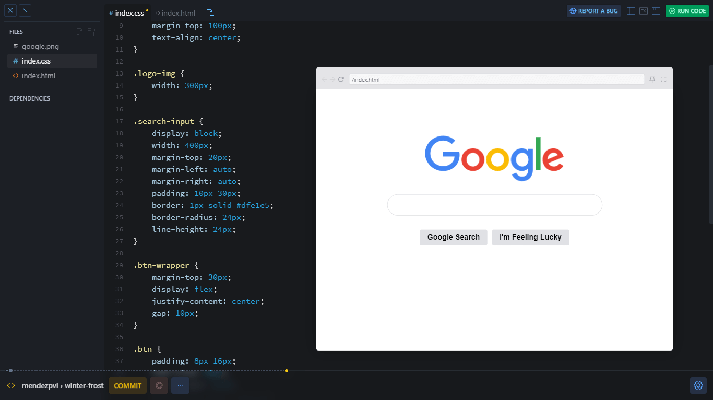

# Google Clone

## Overview 📝

This project is part of the **Web Dev Basics** module of [**Scrimba**'s](https://v2.scrimba.com/home) [**Frontend Career Path**](https://v2.scrimba.com/the-frontend-developer-career-path-c0j) programme.

Guided by the instructor, we built a basic ***clone of Google's homepage***, focusing on basic web design and layout techniques.

## Screenshot 📷

## Links 🔗

[Scrim](https://v2.scrimba.com/s015itui0i) 👀

[Demo](https://mendezpvi.github.io/fcp-google-clone/) 👀

## What I learned 🤓

🔲 CSS syntax

🔲 Inline vs block

🔲 The box model:
+ Margin
+ Border
+ Padding
+ Content

🔲 Divs

🔲 Classes

🔲 Centering

🔲 Flexbox

## Author 🔰

✨ Frontend Mentor - [@mendezpvi](https://www.frontendmentor.io/profile/mendezpvi)

✨ X (formerly Twitter) - [@mendezpvi](https://x.com/mendezpvi)